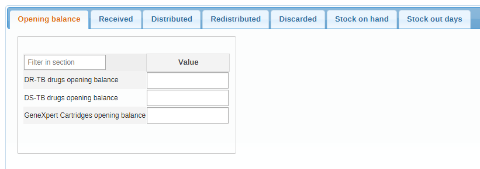
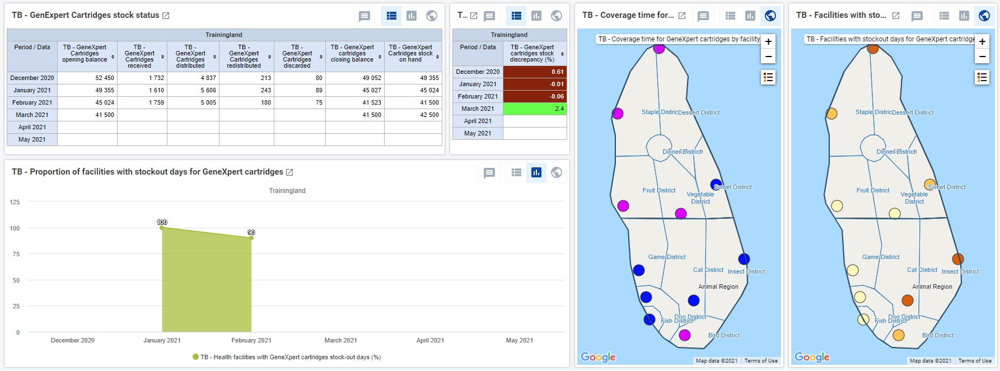

## TB logistics

### TB logistics design

The logistics metadata is designed to be harmonized conceptually across different health programmes. To ease the adoption of these packages in countries, we have included the program-specific metadata into existing DHIS2 metadata for TB programmes. The aggregate HMIS package for malaria therefore includes:

1. Dashboards with visualizations and charts combining health services (HMIS) indicators and key logistics performance indicators (LMIS)
2. Indicators and predictors to generate calculated values as part of the common logistics metadata framework and core performance monitoring indicators for logistics as part of overall programme management
3. Data sets and data elements for facility reporting of logistics data, pre-configured for a set of typical stock items monitored for malaria programmes

This document is intended for use by DHIS2 implementers at country and regional level to be able to support implementation and localization of the package. Local data flows and national guidelines should be considered in the localization and adoption of the programs included in this package.

#### Intended users

- **Health facility users**: capture and report key logistics data for specific health programs. The Facility Stock Report is generally used by pharmacists and storekeepers for recording all essential stock data at the health care facility at the end of every month. Storekeepers maintain their usual paper documentation such as stock cards and bin cards for recording stock receipts and stock issues. At the end of every month, data from these records is entered into DHIS2 for sharing data.

- **National and sub-national (e.g. district level) programme managers**: for monitoring overall health programme performance, analyzing and cross-referencing logistics and health service delivery data to make informed decisions about programmatic interventions

#### Data Sets

Different stock data sets have been configured for each health programme. The decision to create a new dataset instead of including on the HMIS data entry form was taken because:

1. Different users may be responsible for entering stock data or programmatic/health service data at the facility level. Access can be controlled by assigning user groups to the data sets.
2. It is possible to monitor completeness of stock reporting vs. completeness of health services reporting.

It is recommended that the dataset is assigned to Organisation Units **at the lowest level** of the health system feasible for reporting data, such as health facilities or community health workers.

#### Data Entry Form (facility reporting)

After selecting the required Organization Unit and selecting the "Facility Stock Report" Data Set a separate table for reporting logistics data will be displayed.

The list of items will be the same throughout the different tabs.
The "Opening balance" field will automatically display the Stock on hand from the last day of the previous month.

At the end of every month, the storekeeper will add up the totals for the "Stocks received", "Stocks issued", "Stocks discarded" as well as "Stocks redistributed" during the entire reporting period and record them in DHIS2 for each health product.

The storekeeper then carries out a complete physical stock count of all health products and records the respective stock on hand (total quantity which is physically available in the medical store) in DHIS2.

DHIS2 will calculate the "Closing balance" instantly as values are entered in the Data Entry form. Note that the calculation result will only be correct once all values for the health product have been recorded.

Finally, the storekeeper will review the stock records and count the number of days during the reporting period on which the respective health product was out of stock at any time or for any period of the day.

#### TB logistics analytics

The TB logistics configuration supports core/cross-cutting logistics indicators described in the common metadata framework and logistics performance monitoring indicators. From the data captured, we can also calculate the following indicators which are recommended by the WHO TB Programme for integrated analysis alongside indicators contained in the WHO HMIS health programmes packages.

| LMIS TB Indicator                                              | Numerator                                                               | Denominator                                                                          |
|----------------------------------------------------------------|-------------------------------------------------------------------------|--------------------------------------------------------------------------------------|
| GeneXpert cartridges stock discrepancy (%)                     | stock on hand-(received+opening balance-discarded-issued-redistributed) | stock on hand                                                                        |
| GeneXpert cartridges stock coverage time                       | opening balance + received                                              | discarded + issued + redistributed                                                   |
| Health facilities with GeneXpert cartridges stock-out days (%) | facilities with stock-out days reported                                 | Facilities with stock-out days reported + facilities without stock-out days reported |
| DR-TB drugs stock coverage time                                | opening balance + received                                              | discarded + issued + redistributed                                                   |
| DS-TB drugs stock coverage time                                | opening balance + received                                              | discarded + issued + redistributed                                                   |
| GeneXpert cartridges wastage rate (%)                          | (closing balance - stock on hand) + discarted                           | closing balance - stock on hand + discarted + issued                                 |
| DS-TB drugs wastage rate (%)                                   | (closing balance - stock on hand) + discarted                           | closing balance - stock on hand + discarted + issued                                 |
| DR-TB drugs wastage rate (%)                                   | (closing balance - stock on hand) + discarted                           | closing balance - stock on hand + discarted + issued                                 |
| DS-TB drugs stock discrepancy (%)                              | stock on hand-(received+opening balance-discarded-issued-redistributed) | stock on hand                                                                        |
| DR-TB drugs stock discrepancy (%)                              | stock on hand-(received+opening balance-discarded-issued-redistributed) | stock on hand                                                                        |
| Health facilities with DR-TB drugs stock-out days (%)          | facilities with stock-out days reported                                 | Facilities with stock-out days reported + facilities without stock-out days reported |
| Health facilities with DS-TB drugs stock-out days (%)          | facilities with stock-out days reported                                 | Facilities with stock-out days reported + facilities without stock-out days reported |

#### Stock Dashboard

The dashboard has a first dialog window with some key definitions to facilitate the reading and interpretation of the data.

The structure is consistent throughout the dashboard:

- A table with the stock status of the item

- A table with the stock discrepancy - see the dialog window for the colour legend

- A map with the stock coverage time for the item

- A map with the stock-out days of the item by facility

- A graph with the proportion of facilities reporting stock-out days

Extra items will be available depending on the possibility to triangulate HMIS vs LMIS data.

#### Validation

The following data validation rules have been configured.

| Name                                                                                                          | Instruction                                                                                                                             | Operator              | LeftSide                           | RightSide                                                            |
|---------------------------------------------------------------------------------------------------------------|-----------------------------------------------------------------------------------------------------------------------------------------|-----------------------|------------------------------------|----------------------------------------------------------------------|
| TB - DR-TB drugs  stock out days <=30 days                                                                    | DR-TB drugs stock out days should be less than or equal to 30 days                                                                      | less_than_or_equal_to |  Stock out days                    | 30 days                                                              |
| TB - DR-TB drugs stock on hand<=DR-TB drugs opening balance + DR-TB drugs received                            | DR-TB drugs stock on hand should be less than or equal to DR-TB drugs opening balance + DR-TB drugs received                            | less_than_or_equal_to | DR-TB drugs stock on hand          | DR-TB drugs opening balance + DR-TB drugs received                   |
| TB - DS-TB drugs redistributed<=DS-TB drugs opening balance + DS-TB drugs received                            | DS-TB drugs redistributed should be less than or equal to DS-TB drugs opening balance + DS-TB drugs received                            | less_than_or_equal_to | DS-TB drugs redistributed          | DS-TB drugs opening balance + DS-TB drugs received                   |
| TB - DR-TB drugs discarded<=DR-TB drugs opening balance + DR-TB drugs received                                | DR-TB drugs discarded should be less than or equal to DR-TB drugs opening balance + DR-TB drugs received                                | less_than_or_equal_to | DR-TB drugs discarded              | DR-TB drugs opening balance + DR-TB drugs received                   |
| TB - DS-TB drugs  stock out days<=30 days                                                                     | DS-TB drugs stock out days should be less than or equal to 30 days                                                                      | less_than_or_equal_to |  Stock out days                    | 30 days                                                              |
| TB - DR-TB drugs redistributed<=DR-TB drugs opening balance + DR-TB drugs received                            | DR-TB drugs redistributed should be less than or equal to DR-TB drugs opening balance + DR-TB drugs received                            | less_than_or_equal_to | DR-TB drugs redistributed          | DR-TB drugs opening balance + DR-TB drugs received                   |
| TB - DS-TB drugs discarded<=DS-TB drugs opening balance + DS-TB drugs received                                | DS-TB drugs discarded should be less than or equal to DS-TB drugs opening balance + DS-TB drugs received                                | less_than_or_equal_to | DS-TB drugs discarded              | DS-TB drugs opening balance + DS-TB drugs received                   |
| TB - GenExpert Cartridges discarded<=GenExpert Cartridges opening balance + GenExpert Cartridges received     | GenExpert Cartridges discarded should be less than or equal to GenExpert Cartridges opening balance + GenExpert Cartridges received     | less_than_or_equal_to | GenExpert Cartridges discarded     | GenExpert Cartridges opening balance + GenExpert Cartridges received |
| TB - GenExpert Cartridges distributed<=GenExpert Cartridges opening balance + GenExpert Cartridges received   | GenExpert Cartridges distributed should be less than or equal to GenExpert Cartridges opening balance + GenExpert Cartridges received   | less_than_or_equal_to | GenExpert Cartridges distributed   | GenExpert Cartridges opening balance + GenExpert Cartridges received |
| TB - GenExpert Cartridges redistributed<=GenExpert Cartridges opening balance + GenExpert Cartridges received | GenExpert Cartridges redistributed should be less than or equal to GenExpert Cartridges opening balance + GenExpert Cartridges received | less_than_or_equal_to | GenExpert Cartridges redistributed | GenExpert Cartridges opening balance + GenExpert Cartridges received |
| TB - DR-TB drugs distributed<=DR-TB drugs opening balance + DR-TB drugs received                              | DR-TB drugs distributed should be less than or equal to DR-TB drugs opening balance + DR-TB drugs received                              | less_than_or_equal_to | DR-TB drugs distributed            | DR-TB drugs opening balance + DR-TB drugs received                   |
| TB - GenExpert Cartridges stock out days<=30 days                                                             | GenExpert Cartridges stock out days should be less than or equal to 30 days                                                             | less_than_or_equal_to | Stock out days                     | 30 days                                                              |
| TB - DS-TB drugs distributed<=DS-TB drugs opening balance + DS-TB drugs received                              | DS-TB drugs distributed should be less than or equal to DS-TB drugs opening balance + DS-TB drugs received                              | less_than_or_equal_to | DS-TB drugs distributed            | DS-TB drugs opening balance + DS-TB drugs received                   |
| TB - GenExpert Cartridges stock on hand<=GenExpert Cartridges opening balance + GenExpert Cartridges received | GenExpert Cartridges stock on hand should be less than or equal to GenExpert Cartridges opening balance + GenExpert Cartridges received | less_than_or_equal_to | GenExpert Cartridges stock on hand | GenExpert Cartridges opening balance + GenExpert Cartridges received |
| TB - DS-TB drugs stock on hand<=DS-TB drugs opening balance + DS-TB drugs received                            | DS-TB drugs stock on hand should be less than or equal to DS-TB drugs opening balance + DS-TB drugs received                            | less_than_or_equal_to | DS-TB drugs stock on hand          | DS-TB drugs opening balance + DS-TB drugs received                   |

#### User Groups

In addition to the regular Admin and access user profiles, the LMIS dataset brings an extra user group:
Stock data capture: designed to enable access to the facility level reporter that is responsible for stock reporting; depending on local context, this may or may not be the same person that is responsible for monthly reporting of health services data  --> **TB stock data capture**

Please refer to the installation guidance for more information on the other user groups.

#### Customizing Data Entry Forms

The dataset in this package does not contain a custom form. However, many countries may require a custom form interface to more closely match paper records and forms used in countries; and to facilitate a more intuitive user interface for the data entry user. To improve the usability of the form for data entry, implementers may design a custom form to meet their needs by following the DHIS2 User manual: [Manage Custom Forms](#manage_customform)
